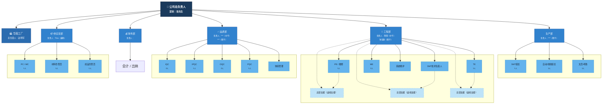

# 组织架构图 — Mermaid 版本

```mermaid
flowchart TB
    %% ── Styles ──────────────────────────────────────────────────────────
    classDef company fill:#1a3a5c,stroke:#0d2137,color:#ffffff,font-size:13px,font-weight:bold
    classDef factory fill:#2b6cb0,stroke:#1a4a8a,color:#ffffff,font-size:12px
    classDef dept fill:#3182ce,stroke:#2b5fa8,color:#ffffff,font-size:11px
    classDef team fill:#63b3ed,stroke:#4a9fd4,color:#1a202c,font-size:10px
    classDef support fill:#bee3f8,stroke:#90cdf4,color:#1a202c,font-size:10px,stroke-dasharray:5 3

    %% ── Root ────────────────────────────────────────────────────────────
    C0["🏢 公司总负责人<br/><sub>深圳：张先生</sub>"]
    C0:::company

    F1["🏭 华南工厂<br/><sub>总负责人：赵明军</sub>"]
    F1:::factory

    C0 --> F1

    %% ── Department branches ─────────────────────────────────────────────
    C0 --> P["生产部<br/><sub>负责人：***（精干）</sub>"]
    P:::dept

    C0 --> E["🔧 工程部<br/><sub>负责人：黎管（中干）<br/>钟玉勤（精干）</sub>"]
    E:::dept

    C0 --> Q["✅ 品质部<br/><sub>负责人：***（中干）<br/>***（精干）</sub>"]
    Q:::dept

    C0 --> S["📦 供应货部<br/><sub>负责人：Tina（越南）</sub>"]
    S:::dept

    C0 --> F["💰 财务部<br/><sub>负责人：</sub>"]
    F:::dept

    %% ── Production Division ─────────────────────────────────────────────
    P --> PT1["SMT组长<br/><sub>1人</sub>"]
    P --> PT2["自动/线线组长<br/><sub>1人</sub>"]
    P --> PT3["文员/考勤<br/><sub>1人</sub>"]
    PT1:::team
    PT2:::team
    PT3:::team

    %% ── Engineering Division ────────────────────────────────────────────
    E --> ET1["PE / 维修<br/><sub>1人</sub>"]
    E --> ET2["SMT技术负责人<br/>"]
    E --> ET3["TE<br/><sub>1人</sub>"]
    E --> ET4["ME<br/><sub>2人</sub>"]
    E --> ET5["系统维护<br/>"]
    ET1:::team
    ET2:::team
    ET3:::team
    ET4:::team
    ET5:::team

    E -.-> ES1["总部支援（虚线支援）"]
    E -.-> ES2["总部支援（虚线支援）"]
    E -.-> ES3["总部支援（虚线支援）"]
    ES1:::support
    ES2:::support
    ES3:::support

    ET1 -.-> ES1
    ET2 -.-> ES2
    ET3 -.-> ES3

    %% ── Quality Division ───────────────────────────────────────────────
    Q --> QT1["IQC<br/><sub>2人</sub>"]
    Q --> QT2["IPQC<br/><sub>1人</sub>"]
    Q --> QT3["OQC<br/><sub>2人</sub>"]
    Q --> QT4["PQC<br/><sub>1人</sub>"]
    Q --> QT5["体系管理<br/>"]
    QT1:::team
    QT2:::team
    QT3:::team
    QT4:::team
    QT5:::team

    %% ── Supply Division ────────────────────────────────────────────────
    S --> ST1["PC / MC<br/><sub>1人</sub>"]
    S --> ST2["材料仓管员<br/><sub>1人</sub>"]
    S --> ST3["成品仓管员<br/><sub>1人</sub>"]
    ST1:::team
    ST2:::team
    ST3:::team

    %% ── Finance Division ────────────────────────────────────────────────
    F --> FT1["会计 / 出纳<br/>"]

    %% ── Layout hints ──────────────────────────────────────────────────
    subgraph P_PROD [" "]
        direction TB
        PT1 & PT2 & PT3
    end

    subgraph E_ENG [" "]
        direction TB
        ET1 & ET2 & ET3 & ET4 & ET5
        ES1 & ES2 & ES3
    end

    subgraph Q_QUAL [" "]
        direction TB
        QT1 & QT2 & QT3 & QT4 & QT5
    end

    subgraph S_SUPPLY [" "]
        direction TB
        ST1 & ST2 & ST3
    end
```
